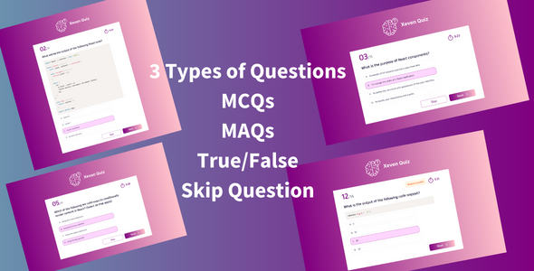
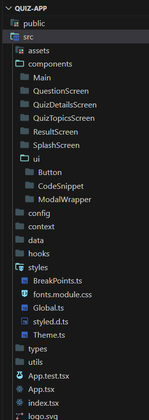
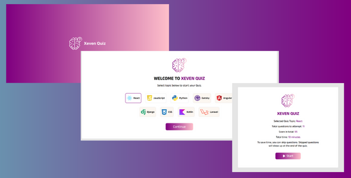

# Sheeple Quiz App

### Link App

To experience the Web App, visit the link: https://sheeple.click

### Powerful Tech Stack

- Reactjs
- Typescript
- Styled components

With **ReactJS** at its core, it lets you design dynamic interfaces that automatically update and respond to user interactions.

**TypeScript** brings enhanced development productivity through static typing and intelligent tooling. 

**Styled Components** ensure fast and intuitive styling, allowing you to create stunning interfaces effortlessly.

## React Quiz App's Code Features

- **TypeScript powered Components**: All components are TypeScript-built for enhanced development productivity with intelligent code completion and compile-time error checking.

- **Easy Theme Customization**: The template provides easy theme management with IntelliSense support via Styled Components and Typescript. It allows you to customize the app's appearance without relying on hard-coded colors.

- **Flexible Question Data Structure**: The template uses Javascript/TypeScript files to define quiz questions. This format provides a structured and flexible approach. The same format can also be used to fetch questions from an API if desired.

- **Modular and Context Pattern**: The template follows a javascript modular and React Context pattern, promoting component reusability and maintainability.

- **Custom Hooks for Logic Sharing**: The hook pattern lets you share logic across components. It also promotes code reuse and minimizes code clutter.

- **Built with React Best Practices**: App follows industry-leading React practices. Our template ensures optimal structure, scalability, and maintainability.

## **How to Start a Project**

To start the project, follow these steps:

1. Install [Nodejs](https://nodejs.org/en/download/package-manager)
2. Clone the repo and navigate to the project directory via terminal.
3. Run the command **`npm install`** to download and install all the project dependencies.
4. Once the dependencies are installed, run the command **`npm start`** to start the development server.

### Folder Structure Explanation

Understanding the folder structure is essential for working with the app. Here's an overview of the main folders:

- **assets**: Contains all the app's assets, such as fonts, icons, and images
- **components**: Contains all the components of app
- **components/UI**: Contains reusable UI components of app
- **context**: Includes a context for sharing logic across the app
- **styles**: Contains styles and their configurations using Styled Components
- **hooks**: Includes reusable hooks used in the app
- **utils**: Contains Javascript helper functions
- **data**: Contains quiz questions and quiz topic screens data
- **types**: Contains TypeScript types used throughout the app
- **config**: Imports all the icons, providing centralized access

### References
- Xeven Quiz - ReactJS Quiz App Template

